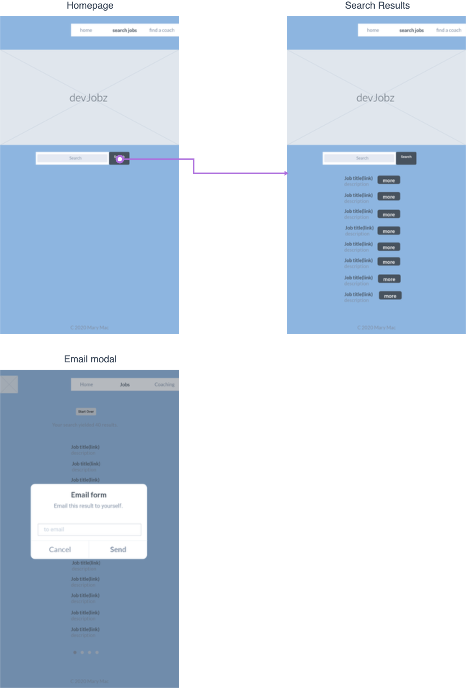
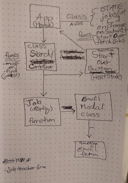

# [devJobz](http://my-project-title.surge.sh/)


## MVP 
Search developer jobs in your area.  

## Wireframe




## Component Hierarchy 

```
src/
|__ App.css
|__ index.css
|__ index.js
|__ App.js  (axios call, state: jobslist: [], value: '', isLoading: true)
|__ components/
      |__ loader.js (cool loader dude: https://www.npmjs.com/package/react-spinners)
      |__ Input.js (reusable form function)
      |__ jobsearch.js (.map of axios data)
      |__ jobdisplay.js (display of mapped data and 'showmore' buttons) 
|__ images/
    |__ babyyoda.png
    |__ logo.png
```

#### Data

|    API     | Quality Docs? | Website       | Sample Query                            |
| :--------: | :-----------: | :------------ | :-------------------------------------- |
| Github |      yes      | https://jobs.github.com/api | https://jobs.github.com/positions.json?description=react&location=new+york |


## Goals 
MUST HAVE: Search developer jobs in your area.

Functional Requirements
* Be built with HTML, CSS, JavaScript, and use React as my front-end framework.
* Use Axios to consume data from an external source, and render that data via multiple components using react, passing state as props and resetting props.
* Use Z layout and flexbox.
* Implement responsive design on 3 screen sizes (including desktop) using 2 media queries (tablet and mobile).
* Host on Surge.

Procedural Requirements
* Create a develop branch to work off of, commit to it and new major version to master once per day or after each component is working.
* Have a well-developed README.md file explaining technologies used, approaches taken, a link to my live site, relevant instructions for viewers, and any unsolved problems.


## POST-MVP Goals:

* Could have: Career coach search component using TheMuse API. https://www.themuse.com/developers/api/v2  This API stunk, 500 server errors every other call for career coach search.
* Try out this component library: https://github.com/OfficeDev/office-ui-fabric-react. 
* Send a search result to yourself or a friend via email.


## SWOT Analysis 

| Strengths  | Weaknesses |
| --- | --- |
| basic react component lifecycle and setting state  | algorithm planning  |

| Opportunities | Threats |
| --- | --- |
| using component library for styling | component lib research time/effort  |


## Technologies Used
* React JS
* Vanilla Javascript
* Axios
* Html5
* CSS flexbox


#### Relevant instructions for viewers 

#### WIP
* Refactoring main button/input/props components to be reusable for both the Coachsearch components and Jobsearch components.
* Review by UXD professionals.

