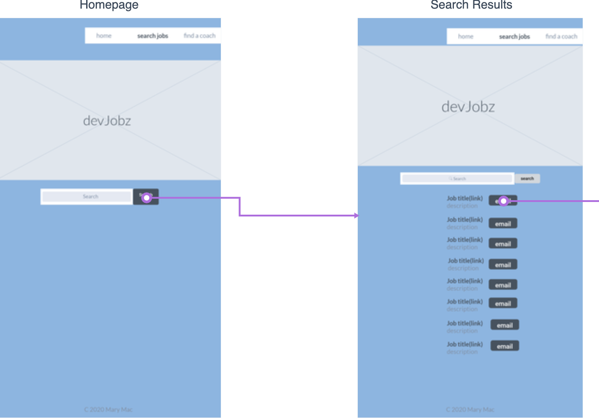
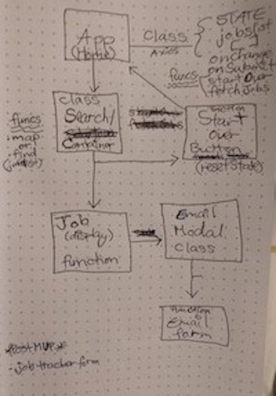

# [Careerz](http://my-project-title.surge.sh/)

## Description
Search developer jobs in your area.  Send your search results to yourself or a friend via email.

## Wireframe

## component hierarchy 

## api: 

https://jobs.github.com/ 

## mvp goals 
MUST HAVE: Search developer jobs in your area.
Should have: Email modal to send results to yourself or a friend.

Functional Requirements
* Be built with HTML, CSS, JavaScript, and use React as my front-end framework.
* Use Axios to consume data from an external source, and render that data via multiple components using react, passing state as props and resetting props.
* Use Z layout and flexbox.
* Implement responsive design on 3 screen sizes (including desktop) using 2 media queries (tablet and mobile).
* Host on Surge.

Procedural Requirements
* Create a develop branch to work off of, commit to it and new major version to master once per day or after each component is working.
* Have a well-developed README.md file explaining technologies used, approaches taken, a link to my live site, relevant instructions for viewers, and any unsolved problems.

## post-mvp goals:

* Try out this component library: https://github.com/OfficeDev/office-ui-fabric-react.
* Could have: Career coach search component using TheMuse API. https://www.themuse.com/developers/api/v2 

## swot analysis 

| Strengths  | Weaknesses |
| --- | --- |
| basic react component lifecycle and setting state  | algorithm planning  |

| Opportunities | Threats |
| --- | --- |
| using component library for styling | component lib research time/effort  |

## technologies used
* react
* vanilla javascript
* axios
* html5
* css grid and flexbox

#### relevant instructions for viewers

#### wip
* refactor and examine for recursion opps
* UX

